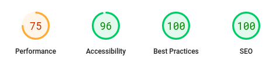
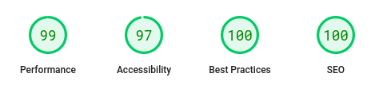
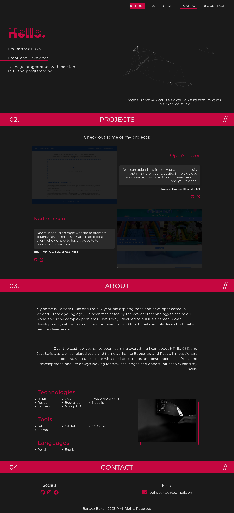
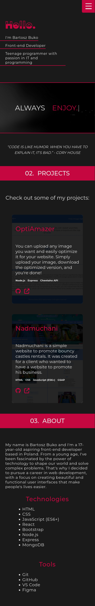

# Nadmuchani 👋

<div style="display: flex;">
  
  
</div>

## About 👀


My partfolio website. <br/>

Mobile version: yes!

PageSpeed Insights:

- [Mobile](https://pagespeed.web.dev/analysis/https-bartoszbuko-netlify-app/m1y2q6b9d8?form_factor=mobile): <br/>
   <br/>
- [Dekstop](https://pagespeed.web.dev/analysis/https-bartoszbuko-netlify-app/m1y2q6b9d8?form_factor=desktop): <br/>
  

## How can I try it? 🤔

Try now on: https://bartoszbuko.netlify.app/ <br/>

## Instalation steps 📋

1. Copy this repository

```
gh repo clone BartoszBuko/portfolio
cd ./portfolio
```

or

```
git clone https://github.com/BartoszBuko/portfolio.git
cd ./portfolio
```

2. Install required packages

```
npm install
```

3. Open App in Development mode

```
npm start
```

Open https://localhost:3000 to view in the browser. <br/>
And that's all!

## About UX/UI 🖌️

I made design all by myself




Figma: [click here](https://www.figma.com/file/loNidJIspbYr7Ovkaar3Ue/portfolio?type=design&node-id=0%3A1&t=dCv3DtJCBgh5dOl3-1) <br>

## Technological facilities 🛠️

- HTML5
- CSS3
- JavaScript (ES6+)

## Used libraries 📚

- [particlesjs](https://vincentgarreau.com/particles.js/)
- [typed.js](https://github.com/mattboldt/typed.js/)
